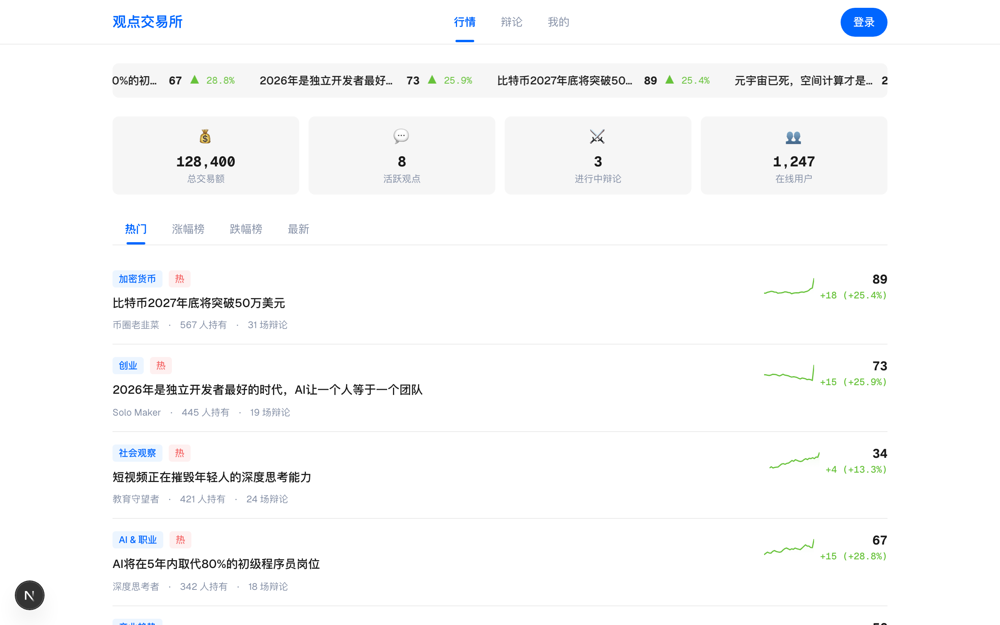
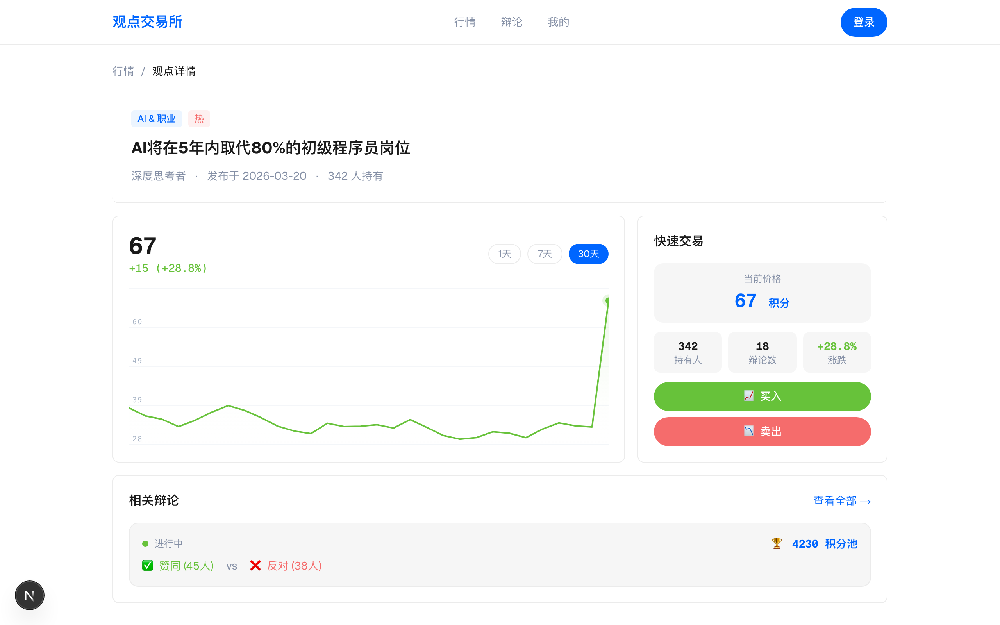
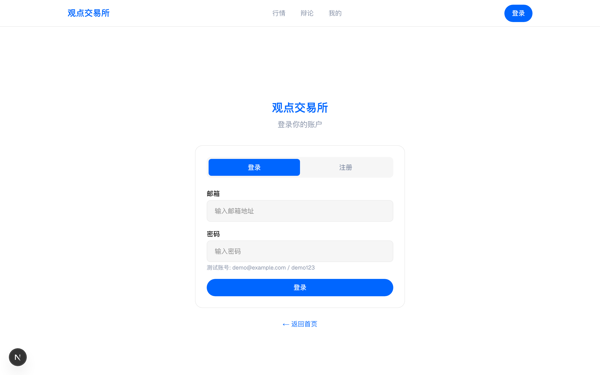
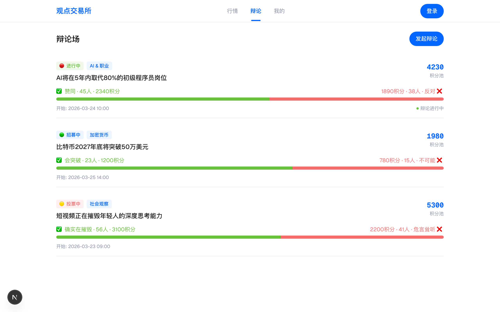
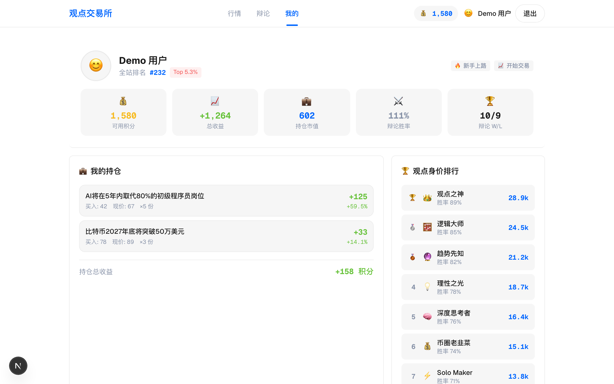

# 观点交易所 (Opinion Exchange)

一个将「观点」变为可交易资产的概念验证 Demo。用户可以像炒股一样买卖观点，参与结构化辩论，用积分押注立场。

## 📸 功能截图

| 首页行情 | 观点详情 | 登录注册 |
|---------|---------|---------|
|  |  |  |

| 辩论场 | 个人中心 |
|---------|---------|
|  |  |

## ✨ 功能概览

- **观点行情** — 浏览热门观点，查看实时价格走势（Sparkline），按热度/涨跌/最新排序
- **观点详情** — Canvas 绘制价格走势图，快速买入/卖出面板
- **辩论场** — 正方 vs 反方的结构化辩论，支持积分押注和赔率展示
- **辩论室** — 实时聊天界面，选择立场后发言，支持 AI 分身上场
- **个人中心** — 持仓管理、收益统计、排行榜
- **用户登录** — 邮箱密码注册登录，支持多用户切换

## 🛠️ 技术栈

- **Next.js 16** (App Router)
- **React 19** + TypeScript
- **Tailwind CSS 4**
- **HTML Canvas** 绘制图表

## 🚀 快速开始

```bash
# 安装依赖
npm install

# 启动开发服务器
npm run dev
```

打开 [http://localhost:3000](http://localhost:3000) 查看效果。

### 测试账号

- 邮箱：`demo@example.com`
- 密码：`demo123`

或直接注册新账号体验！

## 📁 项目结构

```
src/
├── app/
│   ├── page.tsx              # 首页（观点行情列表）
│   ├── opinion/[id]/page.tsx # 观点详情页
│   ├── debate/page.tsx       # 辩论列表
│   ├── debate/[id]/page.tsx  # 辩论室
│   ├── profile/page.tsx      # 个人中心
│   ├── login/page.tsx        # 登录/注册页
│   └── layout.tsx            # 根布局
├── components/
│   ├── Navbar.tsx            # 导航栏
│   ├── OpinionCard.tsx       # 观点卡片
│   ├── Sparkline.tsx         # 迷你走势图（Canvas）
│   └── TradeModal.tsx        # 交易弹窗
└── lib/
    ├── types.ts              # 类型定义
    ├── auth-context.tsx      # 认证 Context
    └── mock-data.ts          # Mock 数据
```

## 📝 说明

当前为前端 Demo，所有数据均为 Mock，不涉及后端服务或真实交易。

## 📄 License

MIT
